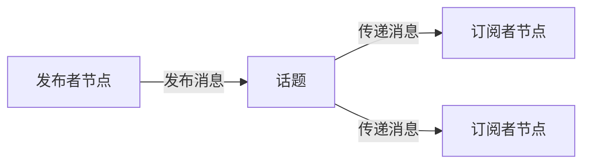
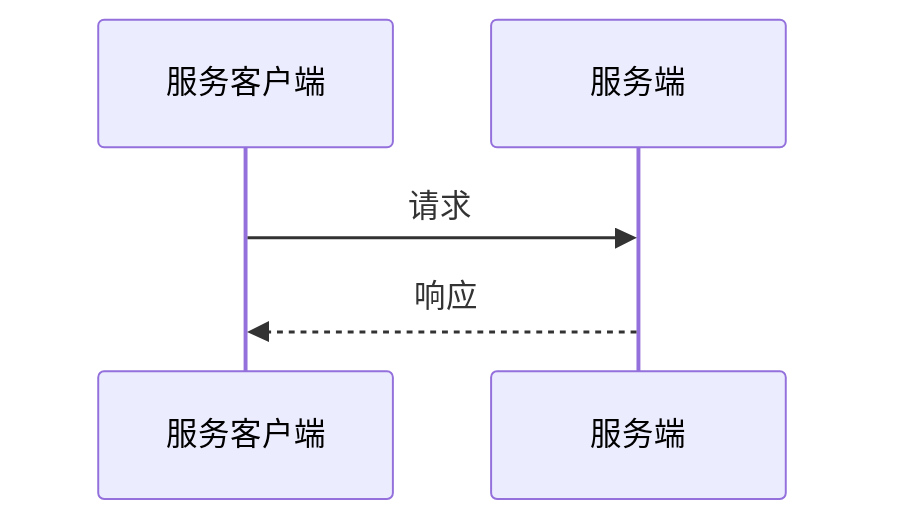
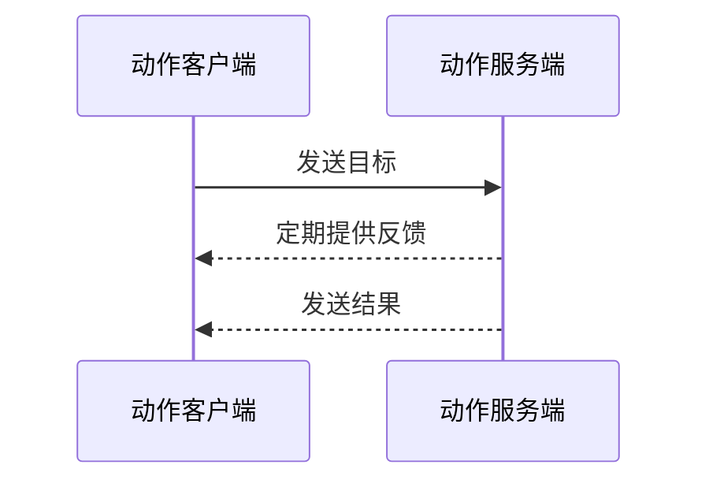

 
# 接口：话题、服务与动作

ROS 中的接口定义了节点交换数据的方式。本文介绍不同类型的 ROS 接口及其区别，帮助你根据用途选择合适的接口。

**领域：ROS 框架 | 内容类型：概念 | 适用水平：初学者**

相关内容：

- [接口定义](About-Interfaces.md)
- [话题](About-Topics.md)
- [服务](About-Services.md)
- [动作](About-Actions.md)

## 概述

ROS 节点通常通过以下三类接口通信：

- 话题：用于连续的数据流。
- 服务：用于同步的请求/响应交互，即可以立即执行的短时任务。
- 动作：用于带反馈的长时间任务，即可能需要一定时间才能完成的任务。

为保证通信双方使用一致的数据定义，各类接口分别使用 `.msg`、`.srv` 或 `.action` 文件提供的定义。

[进一步了解节点](About-Nodes.md)

## 话题

话题接口用于连续的数据流，例如持续传输传感器数据或机器人状态。话题定义保存在 `.msg` 文件中。话题采用发布/订阅模式：一个节点向话题发布数据，其他节点通过订阅接收这些数据。其主要特点是：

- 异步、单向通信。
- 同一个话题可以由多个发布者和订阅者共享。

话题键（topic key）用于标识话题中的各个发布者，使节点和工具能够区分消息来源。当多个发布者共用同一话题时，话题键有助于追踪数据源。

## 话题统计

话题统计是一项内置测量功能，可以帮助你了解订阅接收到消息时的时间特征。启用后，它会自动跟踪以下两项指标：

- **消息年龄（message age）**：根据消息时间戳计算，表示消息到达时已经过去了多长时间。
- **消息周期（message period）**：相邻消息到达的时间间隔。

ROS 使用滑动窗口计算消息年龄和消息周期的平均值、最小值、最大值、标准差以及样本数，每收到一条新消息就更新一次。这些计算使用专门的工具，以恒定的时间和内存开销执行。为订阅启用话题统计后，ROS 会定期将收集到的数据以 `MetricsMessage` 消息发布到统计话题。这样便能清楚地观察消息的时间规律、延迟和异常，更容易评估系统性能或诊断消息流相关问题。

!!! tip "提示"
    默认发布间隔为 1 秒，默认统计话题为 `/statistics`。

[了解如何启用话题统计](../../Tutorials/Advanced/Topic-Statistics-Tutorial/Topic-Statistics-Tutorial.md)

## 服务

服务接口用于同步的请求/响应交互，例如发送查询以获取某个机器人的配置。服务定义保存在 `.srv` 文件中。服务采用请求/响应模式：客户端发送请求，服务端返回响应。其主要特点是：

- 同步通信。
- 适合需要确认，或需要根据请求返回结果的短时操作。

## 动作

动作接口用于带反馈的长时间任务，例如让机器人移动到指定位置，或要求机器人执行复杂运动。动作定义保存在 `.action` 文件中。动作允许客户端发送目标、在执行过程中接收反馈、在需要时取消任务，并在有结果时获得结果。其主要特点是：

- 异步通信，提供反馈和结果。
- 适合需要一定时间才能完成的操作。

## ROS 接口的主要区别

三类接口都能实现节点之间的通信，但各有用途。下表总结了它们的区别：

| 接口 | 模式 | 方向 | 是否提供结果 | 典型用途 | 是否支持取消 |
| --- | --- | --- | --- | --- | --- |
| **话题** | 发布/订阅 | 单向 | 否 | 连续数据 | 不支持 |
| **服务** | 请求/响应 | 双向 | 是 | 快速查询 | 不支持 |
| **动作** | 目标/反馈/结果 | 双向，带反馈 | 是 | 长时间任务 | 支持 |
