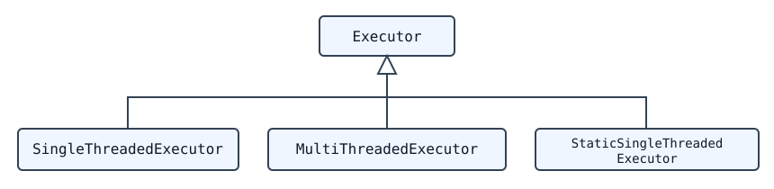

<span id="executors"></span>

# 执行器

<span id="overview"></span>

## 概述

ROS 2 由执行器（Executor）负责执行管理。执行器使用底层操作系统的一个或多个线程，在收到消息和事件时调用订阅、定时器、服务端、动作服务端等的回调函数。显式的 Executor 类位于 rclcpp 的 [executor.hpp](https://github.com/ros2/rclcpp/blob/rolling/rclcpp/include/rclcpp/executor.hpp)、rclpy 的 [executors.py](https://github.com/ros2/rclpy/blob/rolling/rclpy/rclpy/executors.py) 或 rclc 的 [executor.h](https://github.com/ros2/rclc/blob/master/rclc/include/rclc/executor.h) 中。虽然基本 API 与 ROS 1 的 spin 机制十分相似，但执行器提供了更强的执行管理能力。

下文主要介绍 C++ 客户端库 *rclcpp*。

<span id="basic-use"></span>

## 基本用法

最简单的情况下，通过调用 `rclcpp::spin(..)`，使用主线程处理节点收到的消息和事件：

```cpp
int main(int argc, char* argv[])
{
   // Some initialization.
   rclcpp::init(argc, argv);
   ...

   // Instantiate a node.
   rclcpp::Node::SharedPtr node = ...

   // Run the executor.
   rclcpp::spin(node);

   // Shutdown and exit.
   ...
   return 0;
}
```

`spin(node)` 调用基本上相当于创建并调用最简单的执行器——单线程执行器：

```cpp
rclcpp::executors::SingleThreadedExecutor executor;
executor.add_node(node);
executor.spin();
```

调用执行器实例的 `spin()` 后，当前线程开始向 rcl 层和中间件层查询收到的消息及其他事件，并调用相应的回调函数，直到节点关闭。为避免抵消中间件的 QoS 设置，收到的消息不会存放在客户端库层的队列中，而是保留在中间件中，直到回调函数取出消息并处理。这是与 ROS 1 的一个关键区别。执行器通过*等待集*（wait set）获知中间件层是否有可用消息，每个队列对应一个二值标志。等待集也用于检测定时器是否到期。


[组件](About-Composition.md)的容器进程也使用单线程执行器，即在没有显式 main 函数的情况下创建并执行节点时使用它。

<span id="types-of-executors"></span>
<span id="typesofexecutors"></span>

## 执行器类型

本文介绍的 rclcpp 提供三种执行器，它们继承自同一个父类：



*多线程执行器*（Multi-Threaded Executor）创建可配置数量的线程，以并行处理多条消息或多个事件。*静态单线程执行器*（Static Single-Threaded Executor）则优化了扫描节点结构的运行开销，包括扫描订阅、定时器、服务端和动作服务端等。它仅在添加节点时扫描一次，而另外两种执行器会定期检查这些结构是否发生变化。因此，静态单线程执行器只适用于在初始化阶段创建所有订阅、定时器等实体的节点。

三种执行器都支持多个节点，只需为每个节点调用 `add_node(..)`：

```cpp
rclcpp::Node::SharedPtr node1 = ...
rclcpp::Node::SharedPtr node2 = ...
rclcpp::Node::SharedPtr node3 = ...

rclcpp::executors::StaticSingleThreadedExecutor executor;
executor.add_node(node1);
executor.add_node(node2);
executor.add_node(node3);
executor.spin();
```

上例中，静态单线程执行器使用一个线程共同处理三个节点。对于多线程执行器，实际并行程度取决于回调组。

<span id="callback-groups"></span>

## 回调组

ROS 2 允许将节点的回调组织成组。在 rclcpp 中，可以通过 Node 类的 `create_callback_group` 函数创建*回调组*；在 rclpy 中，则调用相应回调组类型的构造函数。必须在节点执行期间一直保存回调组，例如将其保存为类成员，否则执行器将无法触发这些回调。随后，可在创建订阅、定时器等实体时指定回调组。例如，通过订阅选项指定：

### C++

```cpp
my_callback_group = create_callback_group(rclcpp::CallbackGroupType::MutuallyExclusive);

rclcpp::SubscriptionOptions options;
options.callback_group = my_callback_group;

my_subscription = create_subscription<Int32>("/topic", rclcpp::SensorDataQoS(),
                                             callback, options);
```

### Python

```python
my_callback_group = MutuallyExclusiveCallbackGroup()
my_subscription = self.create_subscription(Int32, "/topic", self.callback, qos_profile=1,
                                           callback_group=my_callback_group)
```

创建订阅、定时器等实体时，如果没有指定回调组，它们会被分配到*默认回调组*。在 rclcpp 中可通过 `NodeBaseInterface::get_default_callback_group()` 获取默认回调组，在 rclpy 中则通过 `Node.default_callback_group` 获取。

回调组有两种类型，创建时必须指定：

- **互斥（Mutually exclusive）**：同组回调不能并行执行。
- **可重入（Reentrant）**：同组回调可以并行执行。

不同回调组中的回调始终可以并行执行。多线程执行器将其线程作为线程池，在这些条件允许的范围内尽可能并行处理回调。高效使用回调组的建议参见[使用回调组](../../How-To-Guides/Using-callback-groups.md)。

rclcpp 的 Executor 基类还提供 `add_callback_group(..)`，允许将回调组分配给不同执行器。通过操作系统调度器配置底层线程，可以让某些回调获得比其他回调更高的优先级。例如，可以让控制循环的订阅和定时器优先于节点中其他订阅及普通服务执行。[examples_rclcpp_cbg_executor 软件包](https://github.com/ros2/examples/tree/rolling/rclcpp/executors/cbg_executor)提供了这种机制的示例。

<span id="scheduling-semantics"></span>

## 调度语义

如果回调处理时间短于消息和事件的发生周期，执行器基本上按先进先出（FIFO）的顺序处理它们。但如果某些回调耗时较长，消息和事件就会在软件栈的下层排队。等待集机制向执行器提供的队列信息非常有限，具体而言，它只报告某个话题是否有消息。执行器根据这些信息，以轮转（round-robin）方式处理消息（包括服务和动作），而不是按照 FIFO 顺序。下图展示了这种调度语义。


这种语义最早由 [Casini 等人在 ECRTS 2019 发表的论文](https://drops.dagstuhl.de/opus/volltexte/2019/10743/pdf/LIPIcs-ECRTS-2019-6.pdf)描述。注意：论文还指出定时器事件优先于所有其他消息，但[该优先处理机制已在 Eloquent 中移除](https://github.com/ros2/rclcpp/pull/841)。

<span id="outlook"></span>

## 展望

尽管 rclcpp 的这三种执行器适用于大多数应用，但实时应用要求明确的执行时间、确定性以及对执行顺序的自定义控制，现有执行器仍存在一些不适合此类应用的问题：

1. 调度语义复杂且混杂。理想情况下，需要明确定义的调度语义，才能进行形式化时序分析。
2. 回调可能出现优先级反转：高优先级回调可能被低优先级回调阻塞。
3. 无法显式控制回调的执行顺序。
4. 没有内置机制来控制特定话题的触发行为。

此外，执行器的 CPU 和内存开销也较大。静态单线程执行器显著降低了这些开销，但对某些应用仍可能不够。

以下工作部分解决了这些问题：

- [rclcpp WaitSet](https://github.com/ros2/rclcpp/blob/rolling/rclcpp/include/rclcpp/wait_set.hpp)：rclcpp 的 `WaitSet` 类允许直接等待订阅、定时器、服务端和动作服务端等，而不使用执行器。它可用于实现确定的、用户自定义的处理顺序，也可以一起处理来自不同订阅的多条消息。[examples_rclcpp_wait_set 软件包](https://github.com/ros2/examples/tree/rolling/rclcpp/wait_set)提供了多个使用这种用户层等待集机制的示例。
- [rclc Executor](https://github.com/ros2/rclc/blob/master/rclc/include/rclc/executor.h)：这是为 micro-ROS 开发的 C 客户端库 *rclc* 中的执行器，允许用户精细控制回调执行顺序，并自定义激活回调的触发条件。它还实现了逻辑执行时间（Logical Execution Time，LET）语义中的一些思想。

<span id="further-information"></span>

## 更多资料

- Michael Pöhnl 等：[“ROS 2 Executor: How to make it efficient, real-time and deterministic?”](https://www.apex.ai/roscon-21)。ROS World 2021 研讨会，线上活动，2021 年 10 月 19 日。
- Ralph Lange：[“Advanced Execution Management with ROS 2”](https://www.youtube.com/watch?v=Sz-nllmtcc8&t=109s)。ROS Industrial Conference，线上活动，2020 年 12 月 16 日。
- Daniel Casini、Tobias Blass、Ingo Lütkebohle 和 Björn Brandenburg：[“Response-Time Analysis of ROS 2 Processing Chains under Reservation-Based Scheduling”](https://drops.dagstuhl.de/opus/volltexte/2019/10743/pdf/LIPIcs-ECRTS-2019-6.pdf)。第 31 届 ECRTS 2019 会议论文集，德国斯图加特，2019 年 7 月。
