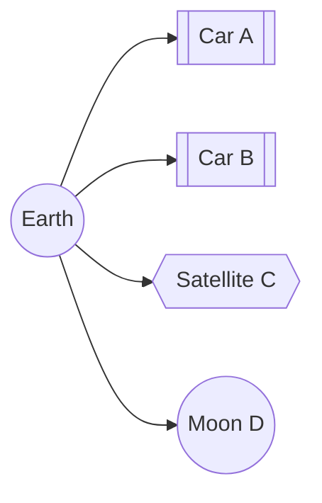

!!! info "翻译说明"

    本页为自动翻译初稿，尚未逐页人工校对；代码、命令和 API 标识保留原文。

# tf2

## 概述

tf2是变换库,可以让用户随时间而跟踪多个坐标帧. tf2维持一个树结构缓冲的坐标帧之间的关系,让用户在任何理想的时间点任意两个坐标帧之间的变换点,向量等.

 

## tf2 属性

一个机器人系统通常拥有许多随时间而变化的3D坐标帧,如世界帧,基帧,抓手帧,头帧等. tf2会随着时间而跟踪所有这些帧,并允许您询问诸如:

- 5秒前的头帧相对于世界帧在哪里?.

- 我的钳子上物体的姿势 相对于我的底部是什么?

- 地图框中基准框架的当前姿势是什么?.

tf2可以在分布式系统中运行,这意味着所有关于机器人坐标框架的信息都可以在系统中任何计算机上的所有ROS 2组件上获得. tf2可以在分布式系统中拥有每一个组件,建立自己的变换信息数据库,或者有一个集中节点来收集和存储所有变换信息.

### 发布变换

当发布变换时, 我们通常会将变换视为从一个帧变换到另一个帧变换。 语义差异在于您是正在变换一个帧代表的数据, 还是要转换帧本身。 这些值是直接反向的 。 `geometry_msgs/msg/Transform` 消息代表框架的配方。 调试已公布的变换时, 请记住这一点。 这些变换是反向的, 取决于您正在旋转变换树的方向 。

$$_{B}T^{data}_{A} = (_{B}T^{frame}_{A})^{-1}$$

TF 库会根据您在变换树上翻转的方式为您处理这些元素。 对于本文件的其余部分,我们将只使用 $T^{data}$ 但是,我们... `data` 是无文字的。

### 立场

如果驾驶员在车里 $A$ 地面上的人想知道它的位置所在, 你将观察从源框转换为目标框。

$$_{E}T_{A} * P_{A}^{Obs} = P_{E}^{Obs}$$

如果B车里的人想知道它的位置 你可以计算出净变换

$$_{B}T_{E} * _{E}T_{A} * P_{A}^{Obs} = _{B}T_{A} * P_{A}^{Obs} = P_{B}^{Obs}$$

就是这样 `lookupTransform` 规定在何种情况下 `A` 是那个 *来源* `frame_id` 财务报告和财务报告 `B` 是那个 *目标* `frame_id`.

建议使用 `transform<T>(target_frame, ...)` 可能时使用的方法,因为它们将读取 *来源* `frame_id` 从数据类型中写入 *目标* `frame_id` 在数据类型和数学中,将在内部加以处理。

若为: $P$ 是一个 `Stamped` 数据类型 $_A$ 是,这是 `frame_id`.

例如,如果一个根框 `A` 框架以下为 1 公尺 `B` 转换从 `A` 改为: `B` 阳性。

然而,在从坐标框架转换数据时 `B` 用于协调框架 `A` 您必须使用这个值的反向。这可以看作是您在修改到较低参考框架时会增加高度值。但是,如果您正在从坐标框架转换数据 `A` 输入坐标框架 `B` 高度会降低,因为新的参考值会更高。

$$_{B}T_{A} = (_{B}{Tf}_{A})^{-1}$$ 

### 速度

代表费 `Velocity` 我们有三条信息 $V^{moving\_frame - reference\_frame}_{observing\_frame}$ 这个速度代表了移动帧和参考帧之间的速度。它体现在观测帧中。

例如,A车的司机可以报告,他们正以1米/秒(相对于地球)的速度前进(在A车中观察到),这样就可以了。 $V_{A}^{A - E} = (1,0,0)$ 虽然从地球的角度可以观察到同样的速度(假设汽车在向东行驶,地球在NED),但从地球的角度来说,这将会是 $V_{E}^{A - E} = (0, 1, 0)$

然而,变换可以表明,这些变化实际上与下列变化相同:

$$_{E}T_{A} * V_{A}^{A - E} = V_{E}^{A - E}$$

速度如果在同一框架内,可以增加或减少。 `Obs`.

$$V_{Obs}^{A - C} = V_{Obs}^{A - B} + V_{Obs}^{D - C}$$

速度可以通过颠倒来“逆转” 。

$$V_{Obs}^{A - C} = -(V_{Obs}^{C - A})$$

如果你想比较两个速度,首先必须将它们转换成同一个观测框架。

## 教程

我创造了一组人, [教程](../../Tutorials/Intermediate/Tf2/Tf2-Main.md) 使用 tf2 来引导您通过。 您可以从 。 [tf2 介绍](../../Tutorials/Intermediate/Tf2/Introduction-To-Tf2.md) 。要完整列出所有 tf2 和 tf2 相关的教程列表,请检查 [教程](../../Tutorials/Intermediate/Tf2/Tf2-Main.md) 页面。

基本上,任何用户都会使用tf2来完成两项主要任务,监听变换和广播变换.

如果您想要使用 tf2 在坐标框之间转换, 您的节点需要监听转换。 您要做的是接收和缓冲系统中播放的所有坐标框, 并查询帧之间的特定转换 。 请检查“ 写入一个听众” 教程 。 [(彼贤).](../../Tutorials/Intermediate/Tf2/Writing-A-Tf2-Listener-Py.md) [(C++)](../../Tutorials/Intermediate/Tf2/Writing-A-Tf2-Listener-Cpp.md) 来学习更多。

为了扩大机器人的能力,您需要开始广播转换。广播转换意味着向系统其它部分发送坐标框的相对位置。一个系统可以拥有许多播音员,每个播音员都提供有关机器人不同部分的信息。请检查“给播音员写信 ” 教程 [(彼贤).](../../Tutorials/Intermediate/Tf2/Writing-A-Tf2-Broadcaster-Py.md) [(C++)](../../Tutorials/Intermediate/Tf2/Writing-A-Tf2-Broadcaster-Cpp.md) 来学习更多。

除此之外, tf2 还可以播放不会随时间变化的静态变换, 这主要节省存储和浏览时间, 但也减少了出版管理费。 您应该注意, 静态变换发布一次, 并假设不会改变, 所以没有历史保存 。 如果您想要定义 tf2 树中的静态变换, 请查看“ 写入静态播音器 ” [(彼贤).](../../Tutorials/Intermediate/Tf2/Writing-A-Tf2-Static-Broadcaster-Py.md) [(C++)](../../Tutorials/Intermediate/Tf2/Writing-A-Tf2-Static-Broadcaster-Cpp.md) 教学。

您也可以在“ 添加框架” 中学习如何在 tf2 树上添加固定和动态框架 [(彼贤).](../../Tutorials/Intermediate/Tf2/Adding-A-Frame-Py.md) [(C++)](../../Tutorials/Intermediate/Tf2/Adding-A-Frame-Cpp.md) 教学。

完成基本教程后,您可以继续学习 tf2 和时间。 tf2 和时间教程 [(C++)](../../Tutorials/Intermediate/Tf2/Learning-About-Tf2-And-Time-Cpp.md) 教授 tf2 和时间的基本原则。关于 tf2 和时间的高级教程 [(C++)](../../Tutorials/Intermediate/Tf2/Time-Travel-With-Tf2-Cpp.md) 教时间旅行原理与 tf2 。

## 纸张

2013年TePRA上发表了一篇关于tf2的文件: [tf: 变换库](https://ieeexplore.ieee.org/abstract/document/6556373).
