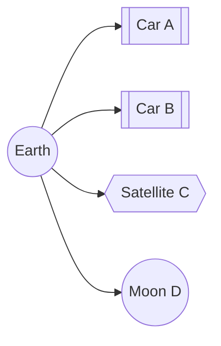

# tf2

## 概述

tf2 是一个坐标变换库，可用于跟踪多个坐标系随时间变化的关系。
它以树形结构维护坐标系之间的关系，并按时间缓存这些信息，使用户能够查询任意时刻的变换，将点、向量等数据从一个坐标系转换到另一个坐标系。

## tf2 的特性

机器人系统通常包含多个随时间变化的三维坐标系，例如世界坐标系、基座坐标系、夹爪坐标系和头部坐标系。
tf2 会持续跟踪这些坐标系，使你能够查询以下信息：

- 5 秒前，头部坐标系相对于世界坐标系位于何处？
- 夹爪中物体相对于机器人基座的位姿是什么？
- 基座坐标系当前在地图坐标系中的位姿是什么？

tf2 可以在分布式系统中运行。
这意味着系统中任意计算机上的 ROS 2 组件，都能获得机器人的坐标系信息。
可以让分布式系统中的每个组件分别建立自己的变换信息数据库，也可以使用一个中心节点收集并存储所有变换信息。

### 发布变换

发布变换时，我们通常将其理解为从一个坐标系到另一个坐标系的变换。
这里需要区分两种含义：变换在某个坐标系中表示的数据，以及变换坐标系本身。
这两种变换互为逆变换。
通过 `geometry_msgs/msg/Transform` 消息发布的是坐标系本身的变换。
调试已发布的变换时要注意：根据遍历变换树的方向，查询到的变换可能是所发布变换的逆变换。

$$_{B}T^{data}_{A} = (_{B}T^{frame}_{A})^{-1}$$

TF 库会根据遍历变换树的方向，自动完成相应的求逆操作。
本文后续使用的都是 $T^{data}$，但在记号中省略上标 `data`。

### 位置

如果汽车 $A$ 中的驾驶员观察到某个物体，而地面上的人希望知道该物体相对于自己的位置，就需要把观测数据从源坐标系变换到目标坐标系。

$$_{E}T_{A} * P_{A}^{Obs} = P_{E}^{Obs}$$

如果汽车 B 中的人也想知道物体相对于自己的位置，则可以计算组合变换：

$$_{B}T_{E} * _{E}T_{A} * P_{A}^{Obs} = _{B}T_{A} * P_{A}^{Obs} = P_{B}^{Obs}$$

这正是 `lookupTransform` 提供的功能，其中 `A` 是源坐标系的 `frame_id`，`B` 是目标坐标系的 `frame_id`。

建议尽可能使用 `transform<T>(target_frame, ...)` 方法。这些方法会从输入数据中读取源坐标系的 `frame_id`，并在输出数据中写入目标坐标系的 `frame_id`，相关数学运算由内部完成。

如果 $P$ 是一种 `Stamped` 数据类型，那么 $_A$ 就是它的 `frame_id`。

例如，假设根坐标系 `A` 位于坐标系 `B` 下方一米，则从 `A` 到 `B` 的坐标系变换为正。

但是，将数据从坐标系 `B` 转换到坐标系 `A` 时，需要使用该值的逆变换。
这可以理解为：改用位置更低的参考坐标系时，需要增加高度值。
相反，将数据从坐标系 `A` 转换到坐标系 `B` 时，由于新参考坐标系的位置更高，高度值会减小。

$$_{B}T_{A} = (_{B}{Tf}_{A})^{-1}$$

### 速度

表示 `Velocity` 时，需要三个坐标系的信息：

$V^{moving\_frame - reference\_frame}_{observing\_frame}$

这个量描述运动坐标系相对于参考坐标系的速度，并使用观测坐标系表示。

例如，汽车 A 的驾驶员报告车辆以 1 m/s 的速度向前行驶。“向前”是在 A 中观察到的方向，而速度是相对于地面的，因此可以写为 $V_{A}^{A - E} = (1,0,0)$。
如果从地面坐标系观察同一速度，假设汽车向东行驶，且地面坐标系采用 NED（北、东、地）约定，则为 $V_{E}^{A - E} = (0, 1, 0)$。

通过坐标变换，可以看出它们表示的是同一速度：

$$_{E}T_{A} * V_{A}^{A - E} = V_{E}^{A - E}$$

如果速度都在同一坐标系中表示，就可以相加或相减。下面使用的共同观测坐标系是 `Obs`：

$$V_{Obs}^{A - C} = V_{Obs}^{A - B} + V_{Obs}^{D - C}$$

速度也可以通过取反来反向表示：

$$V_{Obs}^{A - C} = -(V_{Obs}^{C - A})$$

比较两个速度之前，必须先将它们变换到同一个观测坐标系。

## 教程

我们提供了一组[教程](../../Tutorials/Intermediate/Tf2/Tf2-Main.md)，逐步介绍如何使用 tf2。
你可以从 [tf2 入门](../../Tutorials/Intermediate/Tf2/Introduction-To-Tf2.md)开始学习。
完整的 tf2 及相关教程列表见[教程页面](../../Tutorials/Intermediate/Tf2/Tf2-Main.md)。

tf2 的两个主要用途是监听变换和广播变换。

如果需要使用 tf2 在不同坐标系之间转换数据，节点就必须监听变换。
具体来说，节点接收并缓存系统广播的所有坐标系信息，再查询指定坐标系之间的变换。
有关详情，请参阅“编写监听器”教程：[Python](../../Tutorials/Intermediate/Tf2/Writing-A-Tf2-Listener-Py.md)、[C++](../../Tutorials/Intermediate/Tf2/Writing-A-Tf2-Listener-Cpp.md)。

要扩展机器人的能力，就需要广播变换，即向系统中的其他部分发送坐标系的相对位姿。
系统可以包含多个广播器，分别提供机器人不同部分的信息。
有关详情，请参阅“编写广播器”教程：[Python](../../Tutorials/Intermediate/Tf2/Writing-A-Tf2-Broadcaster-Py.md)、[C++](../../Tutorials/Intermediate/Tf2/Writing-A-Tf2-Broadcaster-Cpp.md)。

此外，tf2 可以广播不随时间变化的静态变换。这主要用于减少存储空间和查询时间，同时降低发布开销。
需要注意的是，静态变换只发布一次，并被视为不再变化，因此不会存储历史记录。
如果要在 tf2 树中定义静态变换，请参阅“编写静态广播器”教程：[Python](../../Tutorials/Intermediate/Tf2/Writing-A-Tf2-Static-Broadcaster-Py.md)、[C++](../../Tutorials/Intermediate/Tf2/Writing-A-Tf2-Static-Broadcaster-Cpp.md)。

“添加坐标系”教程介绍了如何在 tf2 树中添加固定和动态坐标系：[Python](../../Tutorials/Intermediate/Tf2/Adding-A-Frame-Py.md)、[C++](../../Tutorials/Intermediate/Tf2/Adding-A-Frame-Cpp.md)。

完成基础教程后，可以继续学习 tf2 与时间。
[tf2 与时间教程（C++）](../../Tutorials/Intermediate/Tf2/Learning-About-Tf2-And-Time-Cpp.md)介绍基本原理。
[tf2 与时间高级教程（C++）](../../Tutorials/Intermediate/Tf2/Time-Travel-With-Tf2-Cpp.md)介绍如何使用 tf2 查询不同时刻的变换。

## 论文

TePRA 2013 上发表了介绍 tf2 的论文：[tf: The transform library](https://ieeexplore.ieee.org/abstract/document/6556373)。
